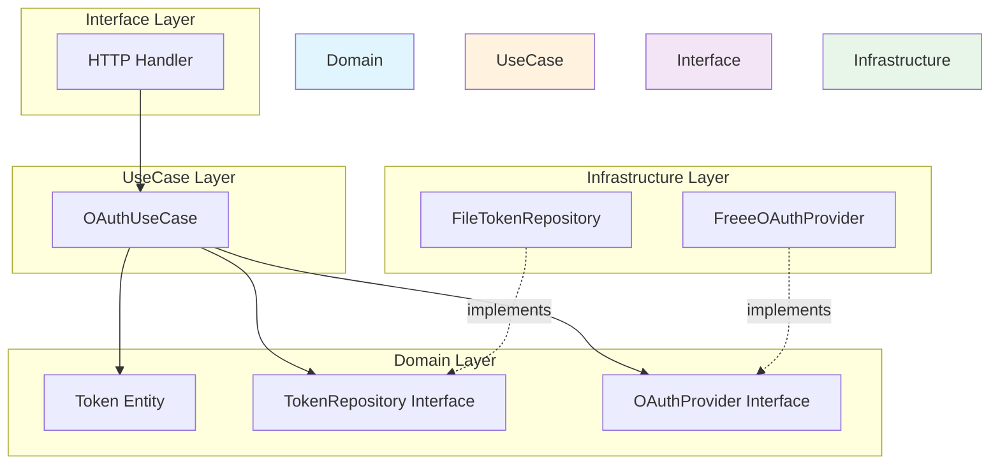
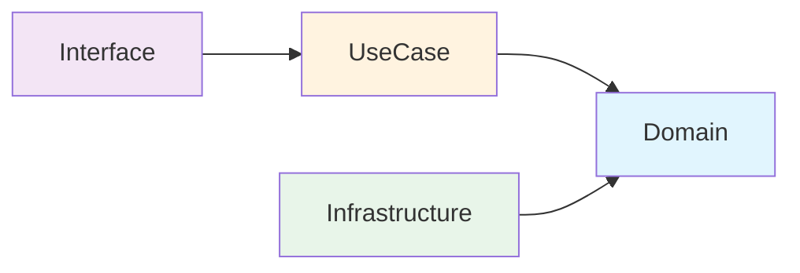
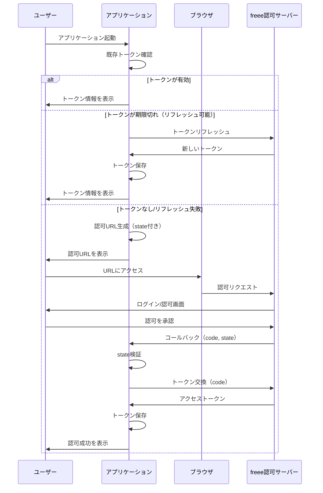

# freee OAuth App

freee APIのOAuth認可フローを実行し、アクセストークンを取得・管理するCLIアプリケーションです。

## 概要

このアプリケーションは、freee APIを利用するために必要なOAuth 2.0認可コードフローを実装しています。ブラウザで認可を行い、取得したアクセストークンをローカルに保存します。

### 主な機能

- OAuth 2.0 認可コードフローによるアクセストークン取得
- トークンのローカルファイルへの永続化
- トークンの自動リフレッシュ
- CSRF対策（stateパラメータ検証）

## アーキテクチャ

Clean Architecture / DDD（Domain-Driven Design）に基づいた4層構造を採用しています。



### 依存関係の方向



内側の層（Domain）は外側の層に依存しません。Infrastructure層はDomain層のインターフェースを実装することで、依存性逆転の原則（DIP）を実現しています。

## OAuth認可フロー



## ディレクトリ構造

```
freee-oauth-app/
├── main.go                      # エントリーポイント・DI設定
├── domain/                      # ドメイン層
│   ├── token.go                 # Token エンティティ
│   ├── token_test.go
│   └── repository.go            # リポジトリ・プロバイダーインターフェース
├── usecase/                     # ユースケース層
│   ├── oauth.go                 # OAuthUseCase
│   └── oauth_test.go
├── infrastructure/              # インフラストラクチャ層
│   ├── persistence/
│   │   ├── file_token_repository.go    # ファイルベースのトークン永続化
│   │   └── file_token_repository_test.go
│   └── freee/
│       ├── oauth_provider.go           # freee OAuth実装
│       └── oauth_provider_test.go
├── interface/                   # インターフェース層
│   └── http/
│       ├── handler.go           # HTTPコールバックハンドラ
│       └── handler_test.go
├── go.mod
├── go.sum
├── CLAUDE.md                    # 開発ガイド
└── README.md                    # このファイル
```

## セットアップ

### 前提条件

- Go 1.21以上
- freee開発者アカウント

### freee APIアプリの作成

1. [freee Developers](https://developer.freee.co.jp/) にアクセス
2. 開発者アカウントでログイン
3. 「アプリ管理」から新規アプリを作成
4. コールバックURLに `http://localhost:8080/callback` を設定
5. Client IDとClient Secretを取得

### 環境変数の設定

```bash
export FREEE_CLIENT_ID="your-client-id"
export FREEE_CLIENT_SECRET="your-client-secret"
```

## 使い方

### ビルド

```bash
go build -o freee-oauth-app .
```

### 実行

```bash
./freee-oauth-app
```

または直接実行：

```bash
go run main.go
```

### 実行フロー

1. **初回実行時**：認可URLが表示されます
2. ブラウザでURLにアクセスし、freeeアカウントでログイン
3. アプリケーションを認可
4. 自動的にコールバックが処理され、トークンが保存されます

```
No existing token. Starting OAuth2 flow...
Visit this URL to authorize the application:

https://accounts.secure.freee.co.jp/public_api/authorize?...

Waiting for authorization...

Authorization successful!

Access token obtained successfully
  Access Token: xxxxxxxxxxxxxxxxxxxx...
  Expires: 2024-01-01T12:00:00+09:00
  Refresh Token: (available)

Token saved to token.json

You can now use this token to make API requests.
```

5. **2回目以降**：保存されたトークンが有効であれば、すぐに利用可能です

```
Loaded existing valid token
  Access Token: xxxxxxxxxxxxxxxxxxxx...
  Expires: 2024-01-01T12:00:00+09:00

Token is ready for API requests.
```

## テスト

```bash
# 全テスト実行
go test ./...

# 詳細出力
go test ./... -v

# 特定のパッケージのみ
go test ./domain/...
go test ./usecase/...
go test ./infrastructure/...
go test ./interface/...
```

## 技術スタック

| カテゴリ | 技術 |
|---------|------|
| 言語 | Go 1.21+ |
| OAuth2ライブラリ | golang.org/x/oauth2 |
| アーキテクチャ | Clean Architecture / DDD |
| 開発手法 | TDD (Test-Driven Development) |

## ライセンス

MIT License
